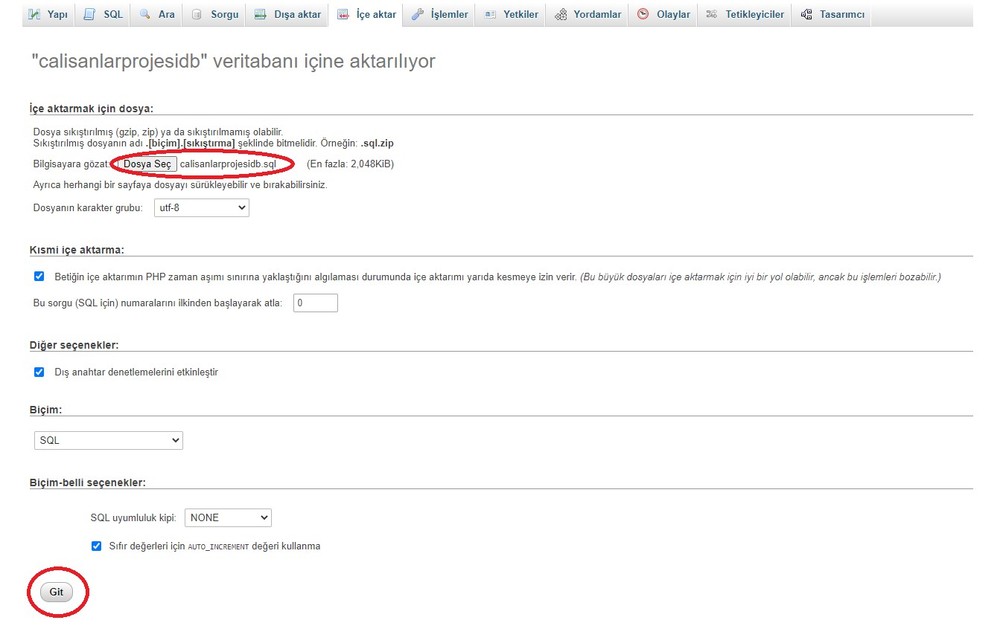

## Employee List Application

For the application to work, the file calisanlardb.sql located in the root directory must be included in phpMyAdmin.

Enter phpMyAdmin and create a new database. Let's name the database we have created as calisanlarprojesidb.


Then, let's import the calisanlarprojesidb.sql file in our project file into the database we have created.



As the last step, let's open the /src/database.java file in edit mode and fill in the necessary information for the database according to you.

```java
public class Database {

  public static final String kullanici_adi = "root";    // Your phpMyAdmin username
  public static final String parola = "sinan123";       // Your phpMyAdmin password

  public static final String db_ismi = "calisanlarprojesidb";   // Database name

  public static final String host = "localhost";

  public static final int port = 3306;
}

```

Username to login to the application: admin

User password to login to the application: admin

##  Contact Information

You can reach out to me using the following contact details:

[](mailto:sinanozcelik@yaani.com)

[](https://www.linkedin.com/in/sinan-ozcelik/)

I'm always open to development and collaboration. Feel free to reach out to me!
